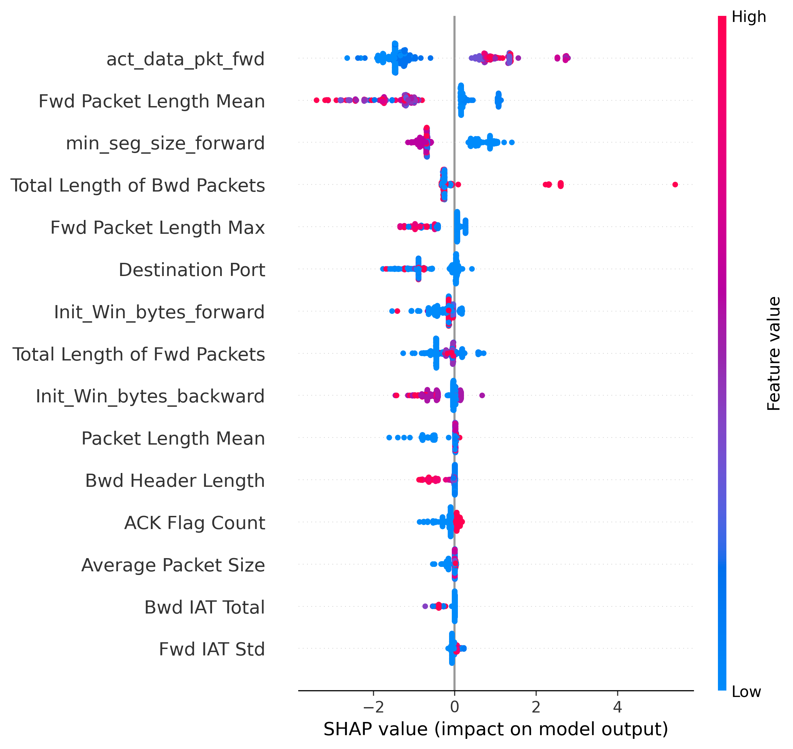

# CyberSentinel-AI

AI-Powered Cyber Threat Intelligence and Intrusion Detection Platform

---

## Overview

CyberSentinel-AI is an advanced cybersecurity platform that combines Machine Learning, Anomaly Detection, Explainable AI (XAI), Threat Intelligence, and Interactive Security Dashboards to detect, classify, explain, and investigate cyber threats.

Built using the CICIDS2017 dataset, the platform provides both supervised and unsupervised threat detection capabilities alongside real-world threat intelligence integration.

---

## Project Highlights

* 99.93% Multi-Class Intrusion Detection Accuracy
* Isolation Forest Anomaly Detection
* SHAP Explainable AI Integration
* AbuseIPDB Threat Intelligence Lookup
* React Security Operations Dashboard
* FastAPI Backend APIs
* AI Security Copilot
* Versioned Development Lifecycle (v0.1 → v1.0)

---

## Features

### Multi-Class Intrusion Detection System (IDS)

Detects and classifies:

* BENIGN
* DDoS
* DoS
* PortScan
* BruteForce
* Bot
* WebAttack

**Model:** XGBoost

**Accuracy:** 99.93%

---

### Anomaly Detection Engine

Identifies suspicious network behavior that deviates from normal traffic patterns.

**Model:** Isolation Forest

**Accuracy:** 67.9%

**Attack Recall:** 78%

---

### Explainable AI (SHAP)

The platform uses SHAP (SHapley Additive exPlanations) to understand and explain model predictions.

Capabilities:

* Feature Importance Analysis
* Model Interpretability
* Threat Attribution
* Transparent Decision Making

#### SHAP Summary Plot



---

### Threat Intelligence Integration

Integrated with AbuseIPDB for real-world IP reputation analysis.

Capabilities:

* IP Reputation Lookup
* Abuse Confidence Score
* Country Information
* Report Statistics
* Threat Level Assessment

Example Response:

```json
{
  "ip": "8.8.8.8",
  "risk_score": 0,
  "country": "US",
  "reports": 117,
  "threat_level": "LOW"
}
```

---

### AI Security Copilot

Provides natural language explanations for cybersecurity concepts and threats.

Capabilities:

* DDoS Attack Explanations
* Port Scan Analysis
* Brute Force Attack Explanations
* Anomaly Investigation
* Security Knowledge Assistance
* Interactive Security Queries

Example:

```text
User:
What is DDoS?

Copilot:
A DDoS attack floods a target with malicious traffic, making services unavailable to legitimate users.
```

---

### Security Operations Dashboard

Built using React and TailwindCSS.

Features:

* Real-Time Threat Analysis
* Threat History Tracking
* Threat Intelligence Lookup
* Risk Visualization
* AI Security Copilot
* Interactive Dashboard Interface

---

### REST APIs

#### Health Check

```http
GET /health
```

#### Threat Prediction

```http
POST /predict
```

#### Threat Intelligence Lookup

```http
GET /threat-intel/{ip}
```

#### AI Security Copilot

```http
GET /copilot?query=...
```

---

## Project Structure

```text
CyberSentinel-AI
│
├── data
│   ├── raw
│   └── processed
│
├── docs
│   └── shap_ddos_summary.png
│
├── frontend
│
├── models
│
├── notebooks
│   ├── 01_data_exploration.ipynb
│   ├── 02_binary_ddos_detection.ipynb
│   ├── 03_feature_importance.ipynb
│   ├── 04_multiclass_attack_detection.ipynb
│   ├── 05_anomaly_detection.ipynb
│   ├── 06_autoencoder_anomaly_detection.ipynb
│   └── 07_model_explainability.ipynb
│
├── src
│   ├── api
│   ├── models
│   ├── features
│   └── utils
│
├── tests
│
├── requirements.txt
└── README.md
```

---

## Technology Stack

### Machine Learning

* Python
* Scikit-Learn
* XGBoost
* Isolation Forest
* SHAP

### Backend

* FastAPI
* Uvicorn
* Pydantic

### Frontend

* React
* TailwindCSS
* Axios
* Vite

### Threat Intelligence

* AbuseIPDB API

### Visualization

* Matplotlib
* SHAP

### Development Tools

* Git
* GitHub
* VS Code

---

## Results

### Multi-Class Attack Classification

| Metric   | Value      |
| -------- | ---------- |
| Accuracy | 99.93%     |
| Classes  | 7          |
| Dataset  | CICIDS2017 |

### Anomaly Detection

| Metric        | Value |
| ------------- | ----- |
| Accuracy      | 67.9% |
| Attack Recall | 78%   |

---

## Version History

### v0.1

* Binary DDoS Detection
* FastAPI Setup

### v0.2

* Multi-Class Attack Classification
* Feature Importance Analysis

### v0.3

* Isolation Forest Anomaly Detection

### v0.4

* Production Prediction API
* Model Integration

### v0.5

* React Security Dashboard

### v0.6

* Threat History Dashboard
* System Status Monitoring

### v0.7

* Explainable AI using SHAP

### v0.8

* Threat Intelligence Integration
* AbuseIPDB Lookup
* Threat Level Assessment

### v0.9

* Enhanced Security Operations Dashboard
* Live Threat Intelligence Display
* Improved User Experience

### v1.0

* AI Security Copilot
* Natural Language Threat Explanations
* Interactive Security Assistant
* Cybersecurity Knowledge Responses

---

## Roadmap

### v1.1

* Gemini/OpenAI Powered Security Copilot
* Advanced Threat Investigation
* Security Recommendations
* Incident Analysis Support

### Future Enhancements

* RAG-Based Cybersecurity Knowledge Base
* SOC Analyst Assistant
* Malware Analysis Agent
* Threat Hunting Module
* SIEM Integration
* Real-Time Packet Monitoring
* Cloud Deployment

---

## Installation

### Clone Repository

```bash
git clone https://github.com/shivaamsingh/CyberSentinel-AI.git

cd CyberSentinel-AI
```

### Create Virtual Environment

```bash
python -m venv venv

venv\Scripts\activate
```

### Install Dependencies

```bash
pip install -r requirements.txt
```

### Start Backend

```bash
python -m uvicorn src.api.main:app --reload
```

### Start Frontend

```bash
cd frontend

npm install

npm run dev
```

---

## Author

**Shivam Singh**

B.Tech CSE (AI/ML)

Cybersecurity • Artificial Intelligence • Machine Learning

GitHub: https://github.com/shivaamsingh
